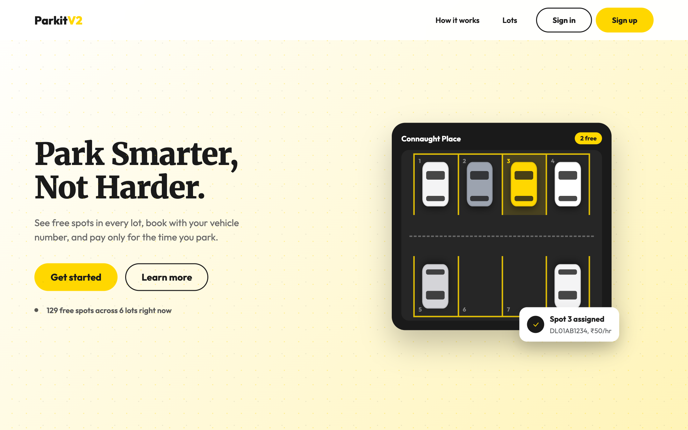

<p align="center"></p>

<h1 align="center">Parkit V2</h1>

<p align="center">A multi-user parking app for 4-wheelers. Users book a spot in a lot and release it when they leave. An admin manages the lots and sees who is parked where. Reminders, monthly reports, and CSV exports run as background jobs.</p>

**Live demo:** https://parkit-v2.vercel.app

| | |
|---|---|
| Program | IIT Madras BS in Data Science, Diploma level |
| Course | Modern Application Development II - Project ([BSCS2006P](https://study.iitm.ac.in/ds/course_pages/BSCS2006P.html)), 2 credits |
| Theory course | Modern Application Development II ([BSCS2006](https://study.iitm.ac.in/ds/course_pages/BSCS2006.html)), 4 credits |
| Problem statement | [Vehicle Parking App - V2](https://docs.google.com/document/d/e/2PACX-1vQdJBJIK0445RS8pl6sAX1pH9hSSWB9NCKfC0jx_9QqKt4frI43HeEvlYQYi1N9HkZ827Z3n4_BiJ8n/pub) |
| Project guidelines | [MAD II project document](https://docs.google.com/document/d/e/2PACX-1vTOvw0KXlhrjBVm635VBGcW0bgvRVcKci1i8lxt78Hz_fEyL1qEsWlpCMWfCTB0MCtjWJsyMpaX9Gvo/pub) |
| Grade | D |

The V1 of this app, built for MAD I with Flask and Jinja, is [Parkit](https://github.com/theshivam7/Parkit).

## Demo logins

| Role | Username or email | Password |
|---|---|---|
| Admin | `admin` | `admin123` |
| User | `demo@parkitv2.com` | `demo1234` |

## Screenshot



## Features

**Users**
- Search lots by name, address, or PIN code, and book one. The first free spot is assigned automatically
- Live timer and running cost for the active booking, then release the spot when you leave
- Booking history, spend per lot, and monthly spend charts
- Export your history as CSV. It runs as a background job and downloads when ready

**Admin**
- Create, edit, and delete lots. Spots are created and resized to match the lot
- Spot grid for each lot, showing the vehicle and user in every occupied spot
- Users list with search and each user's active booking
- Revenue, occupancy, and 14-day booking charts

**Background jobs (Celery + Redis)**
- Daily reminder at 6 PM IST to users who haven't booked in a week
- Monthly HTML report on the 1st: bookings, amount spent, most used lot
- Email to idle users when a new lot opens

Parking is billed per started hour, with a one-hour minimum, at the price saved when the spot was booked. API responses are cached in Redis with expiry, and bookings are safe under concurrent requests.

## Tech stack

      

This is the stack the course requires. The database is created by the app on first run.

## Run it locally

Needs Python 3.12 and Redis (`brew install redis` on macOS).

```bash
git clone https://github.com/theshivam7/ParkitOne.git
cd ParkitOne
python -m venv .venv && source .venv/bin/activate
pip install -r requirements.txt
redis-server --daemonize yes
python app.py
```

Open http://127.0.0.1:8000. For the background jobs, run these in two more terminals:

```bash
celery -A backend.app.celery_app worker --loglevel=info
celery -A backend.app.celery_app beat --loglevel=info
```

Emails are sent only if `MAIL_USERNAME` and `MAIL_PASSWORD` (a Gmail app password) are set. `MAIL_ALLOWED_DOMAINS` limits who can receive them.

## Deploy on Vercel

Add Redis from the Vercel Marketplace and set `SECRET_KEY`, `CRON_SECRET`, and `APP_URL`. Celery tasks run in-process and Vercel Cron triggers the scheduled jobs.

## Author

Built by [Shivam Sharma](https://www.linkedin.com/in/theshivam7/), a student in the IIT Madras BS in Data Science program. Parkit V2 is my project for [Modern Application Development II](https://study.iitm.ac.in/ds/course_pages/BSCS2006.html), one of the courses for the Diploma in Programming.
